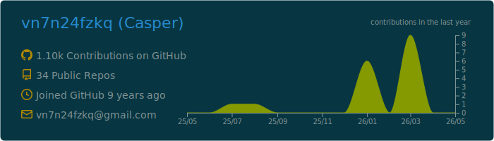
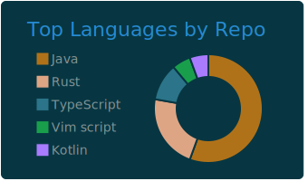
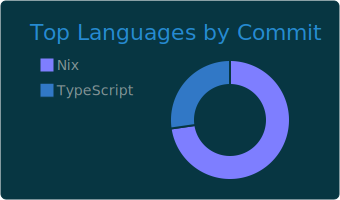
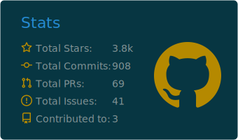

# github-profile-summary-cards-example

Action already setup In this template, you just need click `use this template` button to create your repo and wait for workflow to finish.

```To create your profile README you need name the repo as your username```

Then you can use everything in profile-summary-card-output folder
| :warning: | If your workflow does not generate all cards in output folder, then you need to use [Personal access token](https://docs.github.com/en/actions/configuring-and-managing-workflows/creating-and-storing-encrypted-secrets) instead of GITHUB_TOKEN in workflow. |
| :-------: | :------------------------------------------------------------------------------------------------------------------------------------------------------------------------------------------------------------------------------------------------ |

| :warning: | Don't forget to modify the image path (The correct path is under the profile-summary-card-output folder). |
| :-------: | :-------------------------------------------------------------------------------------------------------- |

[](https://github.com/vn7n24fzkq/github-profile-summary-cards)
[](https://github.com/vn7n24fzkq/github-profile-summary-cards)
[](https://github.com/vn7n24fzkq/github-profile-summary-cards)
[](https://github.com/vn7n24fzkq/github-profile-summary-cards)

[More Info](https://github.com/vn7n24fzkq/github-profile-summary-cards)
